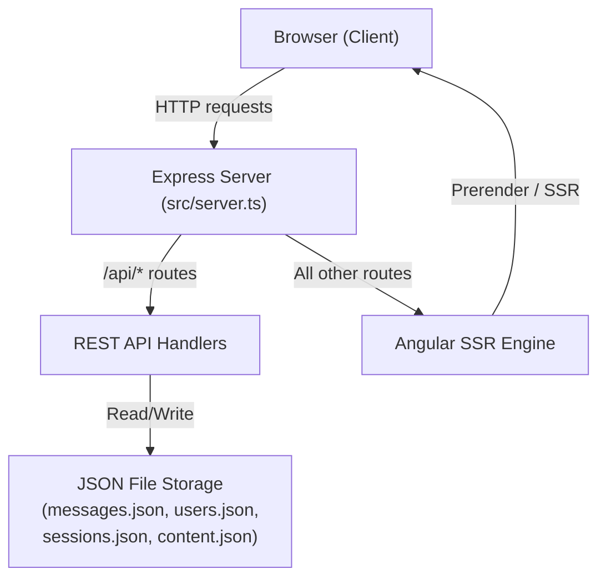

# Design Document

## Overview

Ivan's portfolio website is a full-stack Angular 21 application with server-side rendering (SSR). It serves two audiences: **Visitors** browsing the public portfolio, and **Admins** managing content through a protected dashboard.

The application is a single deployable unit: an Express server that handles both the REST API and Angular SSR rendering. All persistent data (users, sessions, messages, content) is stored as JSON files on disk, keeping the deployment simple with no external database dependency.

The site supports bilingual content (English/Croatian), light/dark theming, smooth section navigation, a contact form, and a full content management dashboard.

---

## Architecture

The application follows a **monolithic SSR architecture** — one Node.js/Express process serves everything.



### Rendering Strategy

| Route | Render Mode |
|---|---|
| `/` (homepage) | Prerender (static HTML at build time) |
| `/dashboard/**` | Server-side render (dynamic, per-request) |

The homepage is prerendered for maximum performance and SEO. Dashboard routes are server-rendered on demand since they require authentication state.

### Client Hydration

After the initial HTML is delivered, Angular hydrates the page using `withEventReplay()`, which replays user interactions that occurred before hydration completes. This ensures interactive features (theme toggle, language toggle, contact form, smooth scroll) become functional without a full page reload.

---

## Components and Interfaces

### Public Homepage

The homepage is a single `Homepage` component that composes all section components in order:

```
Homepage
├── Navbar          — fixed navigation bar with section links, language toggle, theme toggle
├── Hero            — name, role, bio, stats, CV download link
├── Services        — list of professional services with icons
├── Timeline        — chronological experience entries
├── Resume          — separate experience and education lists
├── Skills          — skill bars with proficiency percentages
├── TechStack       — categorised technology lists
├── Contact         — contact info + contact form
└── Footer          — copyright and social links
```

Each section component is a standalone Angular component using `ChangeDetectionStrategy.OnPush` and consuming translations via the `LanguageService`'s reactive `t` signal.

### Navbar Component

Responsibilities:
- Render navigation links for each section
- Highlight the active section link based on scroll position (via `ScrollService.isThresholdExceeded` and Intersection Observer)
- Render language toggle (EN/HR)
- Render theme toggle (light/dark)
- Render "Hire me" CTA button that scrolls to Contact

### Contact Form Component

The contact form is a reactive Angular form (`ReactiveFormsModule`) with three fields:

| Field | Validation |
|---|---|
| `name` | required, minLength(2) |
| `email` | required, email pattern |
| `message` | required, minLength(10) |

Submission flow:
1. Validate on submit
2. Disable submit button, show "Sending..." label
3. POST to `/api/contact`
4. On success: show success message
5. On error: show error message, re-enable submit button

### Dashboard

The dashboard is a lazy-loaded feature module under `/dashboard`:

```
Dashboard (shell with sidebar nav)
├── /dashboard              → Overview
├── /dashboard/messages     → Messages inbox
├── /dashboard/page-customization → Page Customization (tabbed editor)
├── /dashboard/login        → Login form
└── /dashboard/register     → Registration form
```

All routes except `login` and `register` are protected by `authGuard`.

### Page Customization Component

A tabbed editor with one tab per content section: Hero, Services, Skills, Timeline, Tech Stack, Contact.

Each tab renders form fields for both English and Croatian translations side by side. List-based sections (services, skills, timeline entries, tech stack categories) support adding and removing items dynamically.

On "Save Changes":
1. Collect the full bilingual content object
2. PUT to `/api/content` with `Authorization: Bearer <token>`
3. On success: show "Saved successfully" toast for 3 seconds; call `LanguageService.setTranslations()` to update in-memory state
4. On error: show error message, preserve draft

---

## Data Models

### Bilingual Content Object

The central data structure stored in `content.json` and served by `GET /api/content`. It is a two-key object keyed by language code:

```typescript
type Language = 'en' | 'hr';
type TimelineItemType = 'software' | 'engineering' | 'other';

interface Translation {
  name: string;
  nav: NavTranslation;
  hero: HeroTranslation;
  services: ServicesTranslation;
  resume: ResumeTranslation;
  timeline: TimelineTranslation;
  techStack: TechStackTranslation;
  skills: SkillsTranslation;
  contact: ContactTranslation;
  footer: FooterTranslation;
}

type ContentObject = Record<Language, Translation>;
```

Key sub-types:

```typescript
interface Skill { name: string; percentage: number; }         // percentage: 0–100
interface TimelineItem {
  year: string;
  endYear: string;
  title: string;
  company: string;
  location: string;
  type: TimelineItemType;
  description: string;
  tags: string[];
}
interface ServiceItem { title: string; description: string; icon: string; }
interface TechCategory { name: string; items: string[]; }
interface ResumeItem { year: string; title: string; place: string; }
```

### Message

Stored in `messages.json` as an array:

```typescript
interface Message {
  name: string;
  email: string;
  message: string;
  receivedAt: string;  // ISO 8601 timestamp
}
```

### User

Stored in `users.json` as an array:

```typescript
interface User {
  username: string;
  passwordHash: string;  // SHA-256 hex digest
}
```

### Session

Stored in `sessions.json` as an array. Sessions are simple opaque tokens (no JWT expiry — invalidated explicitly on logout):

```typescript
interface Session {
  token: string;       // 32-byte random hex string
  username: string;
  createdAt: string;   // ISO 8601 timestamp
}
```

### Theme

Persisted in `localStorage` under the key `portfolio-theme` as the string `'light'` or `'dark'`.

---

## Correctness Properties

*A property is a characteristic or behavior that should hold true across all valid executions of a system — essentially, a formal statement about what the system should do. Properties serve as the bridge between human-readable specifications and machine-verifiable correctness guarantees.*

### Property 1: Contact form rejects invalid inputs

*For any* contact form submission where the name has fewer than 2 characters, the email is not a valid email address, or the message has fewer than 10 characters, the form SHALL be invalid and the system SHALL not submit the form to the API.

**Validates: Requirements 2.2, 2.3, 2.4**

### Property 2: Language switch updates all visible text

*For any* language selection (`en` or `hr`), after calling `LanguageService.setLanguage()`, the `t` signal SHALL return the translation object for the selected language, and all components consuming `t` SHALL reflect the new language without a page reload.

**Validates: Requirements 3.2, 3.5**

### Property 3: Theme persistence round-trip

*For any* theme value (`light` or `dark`), after `ThemeService.toggleTheme()` is called, the value stored in `localStorage` under `portfolio-theme` SHALL equal the new theme, and a subsequent `ThemeService` initialisation SHALL restore that same theme.

**Validates: Requirements 4.5, 4.6**

### Property 4: Scroll service navigates to correct section

*For any* section ID present in the DOM, calling `ScrollService.scrollToSection(id)` SHALL invoke `scrollIntoView` on the element with that ID.

**Validates: Requirements 5.2**

### Property 5: Content save round-trip

*For any* valid bilingual content object, after a successful `PUT /api/content` request, a subsequent `GET /api/content` request SHALL return an equivalent content object, and `LanguageService.t()` SHALL reflect the new content after `setTranslations()` is called.

**Validates: Requirements 7.8, 8.1, 8.2, 8.3**

### Property 6: Unauthenticated write requests are rejected

*For any* `PUT /api/content` or `GET /api/messages` request that does not include a valid session token in the `Authorization` header, the server SHALL return HTTP 401.

**Validates: Requirements 8.5, 8.6, 9.4**

### Property 7: Contact form submission stores message

*For any* valid contact form submission (name ≥ 2 chars, valid email, message ≥ 10 chars), after a successful `POST /api/contact`, the message SHALL be retrievable via `GET /api/messages` and SHALL contain the original name, email, message text, and a non-empty timestamp.

**Validates: Requirements 9.2, 9.3**

### Property 8: Language service falls back to defaults on API failure

*For any* scenario where `GET /api/content` returns an error, the `LanguageService` SHALL continue to expose the built-in default translations and the homepage SHALL render without error.

**Validates: Requirements 8.4**

---

## Error Handling

### Contact Form

| Scenario | Behaviour |
|---|---|
| Validation failure | Show per-field error messages; do not submit |
| API error on submit | Show error message; re-enable submit button for retry |
| Submission in progress | Disable submit button; show "Sending..." label |

### Content API

| Scenario | Behaviour |
|---|---|
| `GET /api/content` fails on load | Fall back to built-in default translations |
| `PUT /api/content` rejected (401) | Dashboard shows auth error; user redirected to login |
| `PUT /api/content` server error | Dashboard shows error message; draft preserved |

### Authentication

| Scenario | Behaviour |
|---|---|
| Invalid credentials on login | Display authentication error message |
| Unauthenticated access to protected route | Redirect to `/dashboard/login` |
| Token missing on protected API endpoint | Return HTTP 401 |

### SSR / Hydration

- `PlatformService` guards all browser-only APIs (`localStorage`, `window`, `document`) so they are not accessed during server-side rendering.
- `ThemeService` and `ScrollService` only initialise their browser-specific logic when `platform.isBrowser` is true.

---

## Testing Strategy

### Unit Tests (Vitest)

Focus on specific examples, edge cases, and service logic:

- `LanguageService`: default language is `en`; `toggleLanguage()` switches between `en` and `hr`; `setTranslations()` updates the `t` signal
- `ThemeService`: reads `localStorage` on init; falls back to `prefers-color-scheme`; persists on toggle
- `ScrollService`: `scrollToSection()` calls `scrollIntoView` on the correct element
- `AuthService`: stores token on login; clears token on logout; `isLoggedIn` reflects token presence
- Contact form validators: boundary values for name (1 char → invalid, 2 chars → valid), message (9 chars → invalid, 10 chars → valid), email format

### Property-Based Tests (fast-check)

The project uses **[fast-check](https://github.com/dubzzz/fast-check)** for property-based testing, configured to run a minimum of **100 iterations per property**.

Each property test is tagged with a comment in the format:
`// Feature: portfolio-website, Property N: <property text>`

| Property | Test approach |
|---|---|
| P1: Contact form rejects invalid inputs | Generate arbitrary strings for name/email/message that violate each rule; assert form is invalid and no API call is made |
| P2: Language switch updates all visible text | Generate random language selections; assert `t()` returns the correct translation key set for the selected language |
| P3: Theme persistence round-trip | Generate arbitrary theme values; assert localStorage value matches after toggle; assert re-init restores the stored value |
| P4: Scroll service navigates to correct section | Generate arbitrary section IDs; assert `scrollIntoView` is called on the element with that ID |
| P5: Content save round-trip | Generate arbitrary content objects; PUT then GET; assert deep equality; assert `LanguageService.t()` reflects new content after `setTranslations()` |
| P6: Unauthenticated write requests are rejected | Generate arbitrary request bodies and invalid/missing tokens for PUT /api/content and GET /api/messages; assert 401 |
| P7: Contact form submission stores message | Generate valid contact payloads; POST then GET /api/messages; assert message present with all correct fields and non-empty timestamp |
| P8: Language service falls back to defaults | Simulate API failure with arbitrary error types; assert default translations are used and no error is thrown |

### Integration Tests

- Full SSR render: verify the initial HTML response contains rendered section content (no JavaScript required)
- Auth flow: register → login → access protected route → logout → verify redirect
- Content management: login → PUT content → GET content → verify round-trip
